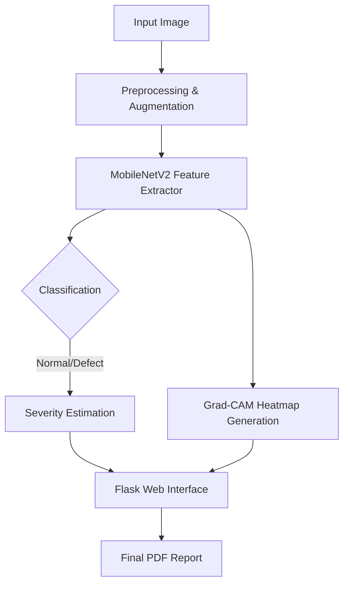

# 🚀 Explainable Industrial Defect Detection

[](https://opensource.org/licenses/MIT)
[](https://www.python.org/downloads/)
[](https://pytorch.org/)

> **Lightweight Explainable AI (XAI) system** for industrial defect detection using MobileNetV2 and Grad-CAM, optimized for edge deployment with a Flask-based web interface.

---

## 📌 Overview

This project provides an end-to-end industrial quality control pipeline. Beyond simple binary classification, the system identifies **where** and **why** a part is considered defective using visual interpretability techniques.

### Core Value Propositions:
* **Defect Classification:** High-speed identification of "Normal" vs "Defective" samples.
* **Visual Interpretability:** Grad-CAM heatmaps to localize defects.
* **Edge-Ready:** Built on MobileNetV2 for low-latency inference on IoT/Edge devices.
* **Actionable Insights:** Automated severity estimation and PDF report generation.

---

## 🎯 Problem Statement

Traditional Deep Learning models in manufacturing often suffer from the **"Black Box"** problem. If a model rejects a part, engineers need to know why. 
1.  **Manual Inspection:** Slow, inconsistent, and expensive.
2.  **Black Box AI:** Lack of trust in automated decisions.
3.  **Hardware Constraints:** Industrial cameras often lack GPU power for heavy Transformers.

**Our Solution:** A transparent, lightweight CNN architecture that provides heatmaps for human verification.

---

## 🧠 System Architecture




---

## 🛠 Tech Stack

| Category | Tools |
| --- | --- |
| **Deep Learning** | PyTorch, MobileNetV2, Grad-CAM |
| **Computer Vision** | OpenCV, NumPy, Matplotlib |
| **Backend** | Flask (Python), REST APIs |
| **Frontend** | HTML5, CSS3, JavaScript |
| **Dataset** | MVTec AD (Anomaly Detection) |

---

## 📂 Project Structure

```text
Explainable-Industrial-Defect-Detection/
│
├── app.py                # Flask web server entry point
├── train_mvtec.py        # MVTec dataset training script
├── predict.py            # Inference & Grad-CAM pipeline
│
├── src/                  # Core Logic
│   ├── model.py          # MobileNetV2 Architecture
│   ├── gradcam.py        # XAI Heatmap implementation
│   ├── severity.py       # Defect area calculation logic
│   └── report_generator.py # PDF Export functionality
│
├── static/               # CSS, JS, and UI Assets
├── templates/            # HTML Dashboards
└── models/               # Saved .pth weights

```

---

## 🔍 Key Features

### 1. Explainable AI (XAI) via Grad-CAM

The system uses **Gradient-weighted Class Activation Mapping**. It computes the gradients of the target concept with respect to the last convolutional layer to produce a localization map highlighting the important regions in the image for prediction.

### 2. Severity Scoring

By analyzing the intensity and area of the Grad-CAM heatmap, the system calculates a **Severity Index**, helping plant managers prioritize critical failures.

### 3. Edge-Optimized Performance

By utilizing **MobileNetV2**, the model maintains a small memory footprint (<10MB), making it ideal for deployment on Raspberry Pi or NVIDIA Jetson modules.

---

## 📊 Model Performance

* **Dataset:** MVTec AD (Industrial objects & textures)
* **Base Accuracy:** ~70% (Baseline prototype)

>Note:
This model prioritizes explainability and lightweight deployment 
over heavy-parameter accuracy-focused architectures.
Future versions will integrate hybrid models for improved precision.

* **Inference Speed:** <50ms per image (CPU)

> **Note:** Priority was given to **Explainability (XAI)** and **Inference Speed** over raw benchmark accuracy to simulate real-world edge constraints.

---

## 🚀 Installation & Setup

### 1. Clone & Navigate

```bash
git clone [https://github.com/jahnavikonatala21/Explainable-Industrial-Defect-Detection.git](https://github.com/jahnavikonatala21/Explainable-Industrial-Defect-Detection.git)
cd Explainable-Industrial-Defect-Detection

```

### 2. Environment Setup

```bash
python -m venv venv
source venv/bin/activate  # On Windows: venv\Scripts\activate
pip install -r requirements.txt

```

### 3. Launch the Dashboard

```bash
python app.py

```

View the app at: `http://127.0.0.1:5000`[YOUR LOCAL HOST]

---

## 🖼 Output Gallery


## 💡 Why Explainability Matters in Industry

In industrial environments, model decisions directly impact 
cost, safety, and production downtime. Black-box predictions 
are often rejected by quality engineers.

By integrating Grad-CAM, this system provides visual evidence 
for each prediction, increasing trust and adoption in real-world deployment.


## 🔬 Future Roadmap

* [ ] **Hybrid Models:** Integrating Vision Transformers (ViT) for higher accuracy.
* [ ] **Containerization:** Dockerizing the Flask app for cloud scaling.
* [ ] **Live Stream:** Support for RTSP industrial camera feeds.
* [ ] **Segmentation:** Adding U-Net for pixel-perfect defect masking.

---

## 🧑‍💻 Author

**Jahnavi Konatala**

* AI & Data Science Student
* [LinkedIn](https://www.linkedin.com/in/jahnavi-konatala-6a533a255/) 

---

## 📜 License

This project is licensed under the MIT License - see the [LICENSE](https://www.google.com/search?q=LICENSE) file for details.

